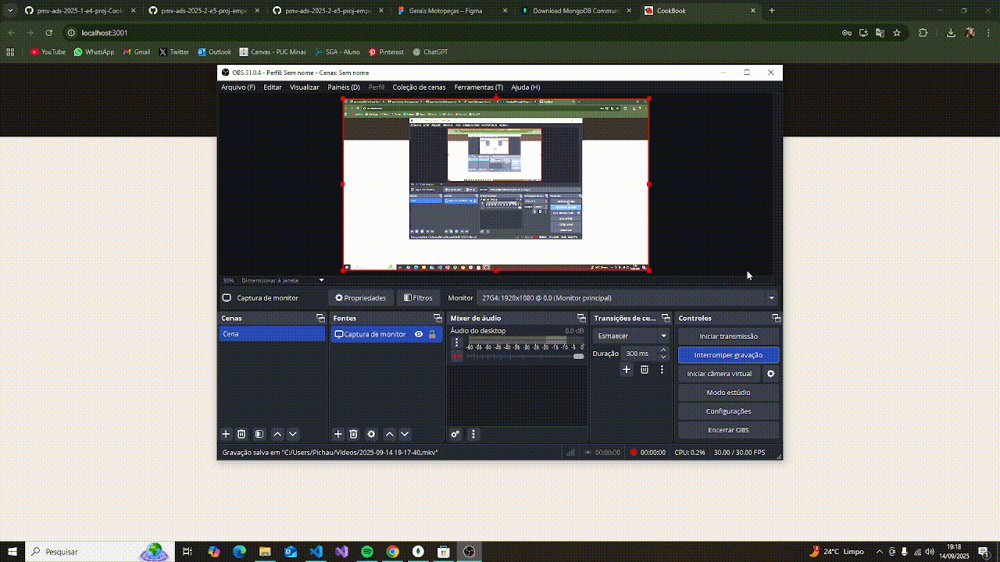

# Planos de Testes de Software

Casos de testes utilizados na realização da verificação e validação da aplicação.

### Tipo de Teste
- **Sucesso**: Tem o objetivo de verificar se as funcionalidades funcionam corretamente.
- **Insucesso**: Tem o objetivo de verificar se o sistema trata erros de maneira correta.

### Casos de Teste de Sucesso

<table>
  <tr>
    <th colspan="2" width="1000">CT-001 - S Login com credenciais válidas</th>
  </tr>
  <tr>
    <td width="150"><strong>Descrição</strong></td>
    <td>Este caso de teste verifica se um usuário pode fazer login com sucesso utilizando credenciais válidas.</td>
  </tr>
  <tr>
    <td><strong>Responsável Caso de Teste </strong></td>
    <td width="430">Larissa Pocceschy Martins</td>
  </tr>
 <tr>
    <td><strong>Tipo do Teste</strong></td>
    <td width="430">Sucesso</td>
  </tr> 
  <tr>
    <td><strong>Requisitos associados</strong></td>
    <td>RF-012: Permitir o login do usuário cadastrado.</td>
  </tr>
  <tr>
    <td><strong>Passos</strong></td>
    <td>
      1. Abrir o aplicativo. 
      2. Inserir o email válido. 
      3. Inserir a senha válida. 
      4. Clicar no botão "Login".
      </td>
  </tr>
    <tr>
    <td><strong>Dados de teste</strong></td>
    <td>
      - <strong>Email:</strong> Colocar email cadastrado na base 
      - <strong>Senha:</strong> Colocar valor de senha válida
  </tr>
    <tr>
    <td><strong>Critérios de êxito</strong></td>
    <td>O sistema deve redirecionar o usuário para a página inicial do aplicativo após o login bem-sucedido.</td>
  </tr>
</table>

<table>
  <tr>
    <th colspan="2" width="1000">CT-002 - S Cadastrar Usuário</th>
  </tr>
  <tr>
    <td width="150"><strong>Descrição</strong></td>
    <td>Este caso de teste verifica se um usuário pode fazer cadastro com sucesso.</td>
  </tr>
  <tr>
    <td><strong>Responsável Caso de Teste </strong></td>
    <td width="430">Larissa Pocceschy Martins</td>
  </tr>
 <tr>
    <td><strong>Tipo do Teste</strong></td>
    <td width="430">Sucesso</td>
  </tr> 
  <tr>
    <td><strong>Requisitos associados</strong></td>
    <td>RF-011: Permitir o cadastro do usuário.</td>
  </tr>
  <tr>
    <td><strong>Passos</strong></td>
    <td>
      1. Abrir o aplicativo. 
      2. Clicar em "Cadastre-se". 
      3. Inserir o email. 
      4. Inserir a senha. 
      5. Clicar no botão "Criar conta".
      </td>
  </tr>
    <tr>
    <td><strong>Dados de teste</strong></td>
    <td>
      - <strong>Email:</strong> Inserir novo email na base 
      - <strong>Senha:</strong> Inserir valor de senha
  </tr>
    <tr>
    <td><strong>Critérios de êxito</strong></td>
    <td>O sistema deve redirecionar o usuário para o login do aplicativo após o cadastro bem-sucedido.</td>
  </tr>
</table>

<table>
  <tr>
    <th colspan="2" width="1000">CT-003 - S Cadastrar Produto</th>
  </tr>
  <tr>
    <td width="150"><strong>Descrição</strong></td>
    <td>Este caso de teste verifica se um usuário pode cadastrar com sucesso.</td>
  </tr>
  <tr>
    <td><strong>Responsável Caso de Teste </strong></td>
    <td width="430">Thabata Dias de Freitas</td>
  </tr>
 <tr>
    <td><strong>Tipo do Teste</strong></td>
    <td width="430">Sucesso</td>
  </tr> 
  <tr>
    <td><strong>Requisitos associados</strong></td>
    <td>RF-001: Permitir o cadastro de peças no estoque com informações detalhadas.</td>
  </tr>
  <tr>
    <td><strong>Passos</strong></td>
    <td>
      1. Clicar em produtos. 
      2. Adicionar dados de produtos. 
      3. Cadastrar produtos. 
      </td>
  </tr>
    <tr>
    <td><strong>Dados de teste</strong></td>
    <td>
      - <strong>Nome</strong>: Inserir nome da peça. 
      - <strong>Código</strong>: Inserir código da peça. 
      - <strong>Descrição</strong>: Inserir descrição. 
      - <strong>Data início de gestão</strong>: Inserir a data em que a peça passou a ser gerida. 
      - <strong>Contém serviço</strong>: Se o produto está associado a um serviço ou não. 
      - <strong>Quantidade mínima</strong>: Inserir quantidade mínima para alerta de reposição. 
      - <strong>Data da última compra:</strong>: Inserir data da última compra da peça. 
      - <strong>Quantidade de estoque</strong>: Inserir quantidade atual disponível em estoque. 
      - <strong>Quantidade vendido</strong>: Inserir quantidade já vendida ou utilizada. 
  </tr>
    <tr>
    <td><strong>Critérios de êxito</strong></td>
    <td>O sistema deve confirmar que o produto foi cadastrado.</td>
  </tr>
</table>

### Casos de Teste de Insucesso

### ETAPA 2  
<table>
  <tr>
    <th colspan="2" width="1000">CT-001 - I01 Login com credenciais inválidas</th>
  </tr>
  <tr>
    <td width="150"><strong>Descrição</strong></td>
    <td>Este caso de teste verifica o tratamento de credenciais inválidas no login.</td>
  </tr>
  <tr>
    <td><strong>Responsável Caso de Teste </strong></td>
    <td width="430">Larissa Pocceschy Martins</td>
  </tr>
 <tr>
    <td><strong>Tipo do Teste</strong></td>
    <td width="430">Insucesso</td>
  </tr> 
  <tr>
    <td><strong>Requisitos associados</strong></td>
    <td>RF-012: O funcionário não conseguirá logar no aplicativo</td>
  </tr>
  <tr>
    <td><strong>Passos</strong></td>
    <td>
      1. Abrir o aplicativo. 
      2. Inserir o email inválido. 
      3. Inserir a senha inválida. 
      4. Clicar no botão "Login".
      </td>
  </tr>
    <tr>
    <td><strong>Dados de teste</strong></td>
    <td>
      - <strong>Email:</strong> Colocar email não cadastrado na base 
      - <strong>Senha:</strong> Colocar senha inválida
  </tr>
    <tr>
    <td><strong>Critérios de êxito</strong></td>
    <td>O sistema deve apresentar a mensagem de login inválido.</td>
  </tr>
</table>

<table>
  <tr>
    <th colspan="2" width="1000">CT-002 Cadastro inválido de produto</th>
  </tr>
  <tr>
    <td width="150"><strong>Descrição</strong></td>
    <td>Este caso de teste verifica dados inválidos no cadastro de produto.</td>
  </tr>
  <tr>
    <td><strong>Responsável Caso de Teste </strong></td>
    <td width="430">Thabata Dias de Freitas</td>
  </tr>
 <tr>
    <td><strong>Tipo do Teste</strong></td>
    <td width="430">Insucesso</td>
  </tr> 
  <tr>
    <td><strong>Requisitos associados</strong></td>
    <td>	RF-001: Não permitir o cadastro de peças no estoque com informações detalhadas.</td>
  </tr>
  <tr>
    <td><strong>Passos</strong></td>
    <td>
     	1. Clicar em produtos.
      2. Adicionar dados inválidos de produtos.
      3. Cadastrar produtos.
      </td>
  </tr>
    <tr>
    <td><strong>Dados de teste</strong></td>
    <td>
      - <strong>Nome</strong>: Inserir nome da peça. 
      - <strong>Código</strong>: Inserir código da peça. 
      - <strong>Descrição</strong>: Inserir descrição. 
      - <strong>Data início de gestão</strong>: Inserir a data em que a peça passou a ser gerida. 
      - <strong>Contém serviço</strong>: Se o produto está associado a um serviço ou não. 
      - <strong>Quantidade mínima</strong>: Inserir quantidade mínima para alerta de reposição. 
      - <strong>Data da última compra:</strong>: Inserir data da última compra da peça. 
      - <strong>Quantidade de estoque</strong>: <STRONG>Não</STRONG> inserir dado de estoque 
      - <strong>Quantidade vendido</strong>: Inserir quantidade já vendida ou utilizada.
  </tr>
    <tr>
    <td><strong>Critérios de êxito</strong></td>
    <td>O sistema deve apresentar a mensagem de erro ao cadastrar produto.</td>
  </tr>
</table>

### ETAPA 3
Criar casos de teste da etapa 3

### ETAPA 4
Criar casos de teste da etapa 4
 
# Evidências de Testes de Software

## Parte 1 - Testes de desenvolvimento
Cada funcionalidade desenvolvida deve ser testada pelo próprio desenvolvedor, utilizando casos de teste, tanto de sucesso quanto de insucesso, elaborados por ele. Todos os testes devem ser evidenciados.

### ETAPA 2
<table>
  <tr>
    <th colspan="6" width="1000">CT-001 Login com credenciais válidas</th>
  </tr>
  <tr>
    <td width="170"><strong>Critérios de êxito</strong></td>
    <td colspan="5">O sistema deve redirecionar o usuário para a página inicial do aplicativo após o login bem-sucedido.</td>
  </tr>
    <tr>
    <td><strong>Responsável pela funcionalidade (desenvolvimento e teste)</strong></td>
    <td width="430">Larissa Pocceschy Martins </td>
     <td width="100"><strong>Data do Teste</strong></td>
    <td width="150">14/09/2025</td>
  </tr>
    <tr>
    <td width="170"><strong>Comentário</strong></td>
    <td colspan="5">O sistema está permitindo o login corretamente.</td>
  </tr>
  <tr>
    <td colspan="6" align="center"><strong>Evidência</strong></td>
  </tr>
  <tr>
    <td colspan="6" align="center">
  </tr>
</table>

<table>
  <tr>
    <th colspan="6" width="1000">CT-002 Cadastrar usuário</th>
  </tr>
  <tr>
    <td width="170"><strong>Critérios de êxito</strong></td>
    <td colspan="5">O sistema deve redirecionar o usuário para o login do aplicativo após o cadastro bem-sucedido.</td>
  </tr>
    <tr>
    <td><strong>Responsável pela funcionalidade (desenvolvimento e teste)</strong></td>
    <td width="430">Larissa Pocceschy Martins </td>
     <td width="100"><strong>Data do Teste</strong></td>
    <td width="150">14/09/2025</td>
  </tr>
    <tr>
    <td width="170"><strong>Comentário</strong></td>
    <td colspan="5">O sistema está permitindo o cadastro corretamente.</td>
  </tr>
  <tr>
    <td colspan="6" align="center"><strong>Evidência</strong></td>
  </tr>
  <tr>
    <td colspan="6" align="center">
  </tr>
</table>

<table>
  <tr>
    <th colspan="6" width="1000">CT-003 Cadastro de produto válido</th>
  </tr>
  <tr>
    <td width="170"><strong>Critérios de êxito</strong></td>
    <td colspan="5">O sistema deve permitir o usuário a cadastrar um novo produto/peça.</td>
  </tr>
    <tr>
    <td><strong>Responsável pela funcionalidade (desenvolvimento e teste)</strong></td>
    <td width="430">Thabata Dias de Freitas</td>
     <td width="100"><strong>Data do Teste</strong></td>
    <td width="150">18/09/2025</td>
  </tr>
    <tr>
    <td width="170"><strong>Comentário</strong></td>
    <td colspan="5">O sistema está permitindo o cadastro de produto corretamente.</td>
  </tr>
 <tr>
  <td colspan="6" align="center">
    <strong>Evidência</strong>  
  </td>
</tr>
</table>

https://github.com/user-attachments/assets/d199d1ab-5832-47c7-adbf-0ade5dcb0c7c

<table>
  <tr>
    <th colspan="6" width="1000">CT-004 Cadastro inválido de produto</th>
  </tr>
  <tr>
    <td width="170"><strong>Critérios de êxito</strong></td>
    <td colspan="5">O sistema não deve permitir o cadastro de um produto quando houver campos obrigatórios faltando ou valores inválidos.</td>
  </tr>
    <tr>
    <td><strong>Responsável pela funcionalidade (desenvolvimento e teste)</strong></td>
    <td width="430">Thabata Dias de Freitas</td>
     <td width="100"><strong>Data do Teste</strong></td>
    <td width="150">18/09/2025</td>
  </tr>
    <tr>
    <td width="170"><strong>Comentário</strong></td>
    <td colspan="5">O teste consistiu em tentar cadastrar um produto sem informar a quantidade de estoque. O sistema retornou erro, impedindo o cadastro, conforme esperado.</td>
  </tr>
 <tr>
  <td colspan="6" align="center">
    <strong>Evidência</strong>  
  </td>
</tr>
</table>

https://github.com/user-attachments/assets/dfe3e9b5-f317-44a4-9e54-61ef926e05af

### ETAPA 3
Colocar evidências de teste da etapa 3

### ETAPA 4
Colocar evidências de teste da etapa 4

## Parte 2 - Testes por pares
A fim de aumentar a qualidade da aplicação desenvolvida, cada funcionalidade deve ser testada por um colega e os testes devem ser evidenciados. O colega "Tester" deve utilizar o caso de teste criado pelo desenvolvedor responsável pela funcionalidade (desenvolveu a funcionalidade e criou o caso de testes descrito no plano de testes) e caso perceba a necessidade de outros casos de teste, deve acrescentá-los na sessão "Plano de Testes".

### ETAPA 2

<table>
  <tr>
    <th colspan="6" width="1000">CT-001 Cadastro válido</th>
  </tr>
  <tr>
    <td width="170"><strong>Critérios de êxito</strong></td>
    <td colspan="5">O sistema deve realizar com sucesso o cadastro.</td>
  </tr>
    <tr>
      <td><strong>Responsável pela funcionalidade</strong></td>
    <td width="430">Larissa Pocceschy Martins</td>
      <td><strong>Responsável pelo teste</strong></td>
    <td width="430">Thabata Dias de Freitas</td>
     <td width="100"><strong>Data do teste</strong></td>
    <td width="150">21/09/2025</td>
  </tr>
    <tr>
    <td width="170"><strong>Comentário</strong></td>
    <td colspan="5">O sistema está permitindo o cadastro corretamente.</td>
  </tr>
  <tr>
    <td colspan="6" align="center"><strong>Evidência</strong></td>
  </tr>
  <tr>
</table>

https://github.com/user-attachments/assets/fc0dee3a-7524-41b4-952f-971a4ab5c84a

### ETAPA 3
Colocar evidências de teste da etapa 3

### ETAPA 4
Colocar evidências de teste da etapa 4

